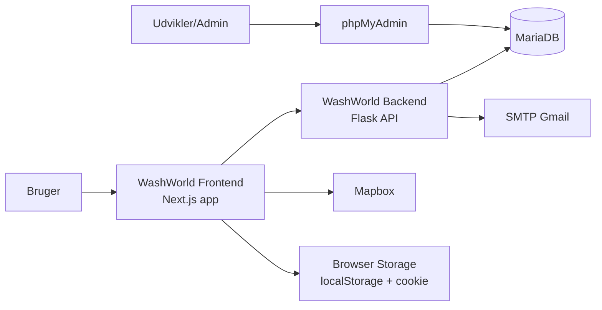
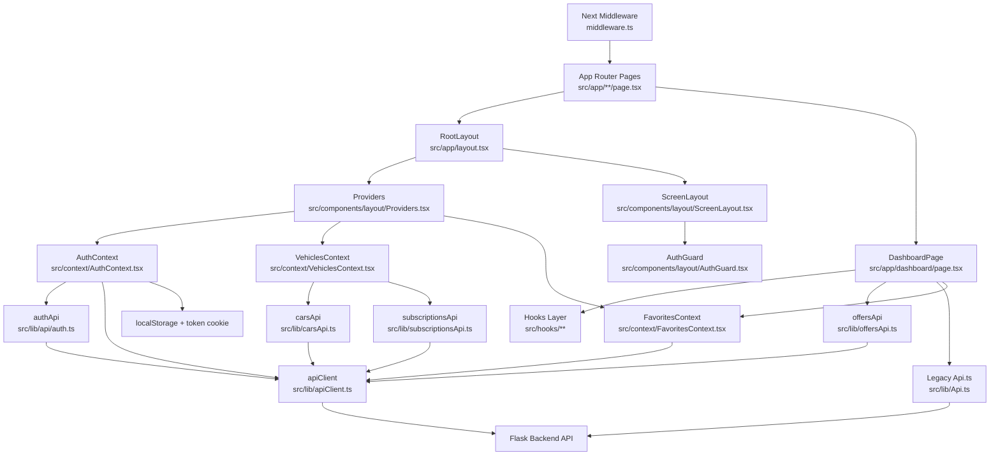
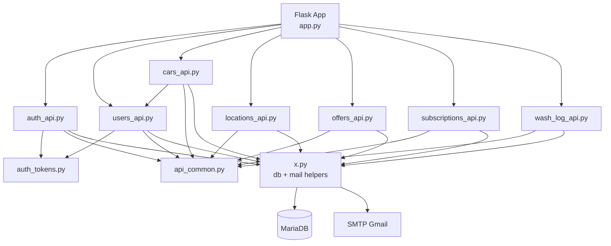

# C4 Diagram - WashWorld

Dette dokument giver et C4-inspireret overblik af hele systemet (frontend + backend), med fokus pa:
- hvilke containere og komponenter der findes
- hvilke filer der ejer ansvaret
- hvordan delene forbinder til hinanden

## 1) System Context

## 2) Container Diagram

### Frontend Container

- **Teknologi:** Next.js (App Router), React, TypeScript
- **Ansvar:** UI, navigation, route protection, klient-side state, API-kald til backend
- **Vigtige filer:**
  - `/Users/andreas/Developer/School/Projects/WashWorld/WashWorld_frontend/src/app/layout.tsx`
  - `/Users/andreas/Developer/School/Projects/WashWorld/WashWorld_frontend/src/components/layout/ScreenLayout.tsx`
  - `/Users/andreas/Developer/School/Projects/WashWorld/WashWorld_frontend/src/components/layout/Providers.tsx`
  - `/Users/andreas/Developer/School/Projects/WashWorld/WashWorld_frontend/middleware.ts`

### Backend Container

- **Teknologi:** Flask + Blueprints, Python, mysql-connector
- **Ansvar:** REST API, auth/JWT, databaseadgang, emails
- **Vigtige filer:**
  - `/Users/andreas/Developer/School/Projects/WashWorld/WashWorld_Backend/app.py`
  - `/Users/andreas/Developer/School/Projects/WashWorld/WashWorld_Backend/routes/*.py`
  - `/Users/andreas/Developer/School/Projects/WashWorld/WashWorld_Backend/routes/auth_tokens.py`
  - `/Users/andreas/Developer/School/Projects/WashWorld/WashWorld_Backend/x.py`

### Database Container

- **Teknologi:** MariaDB
- **Ansvar:** persistens af users, cars, subscriptions, offers, favorites, locations, wash logs
- **Vigtige filer:**
  - `/Users/andreas/Developer/School/Projects/WashWorld/WashWorld_Backend/init.sql`
  - `/Users/andreas/Developer/School/Projects/WashWorld/WashWorld_Backend/sql/*.sql`

### Runtime/Ops Container

- **Teknologi:** Docker Compose
- **Ansvar:** orkestrering af web, DB og phpMyAdmin
- **Vigtige filer:**
  - `/Users/andreas/Developer/School/Projects/WashWorld/WashWorld_Backend/docker-compose.yml`
  - `/Users/andreas/Developer/School/Projects/WashWorld/WashWorld_Backend/Dockerfile`

## 3) Frontend Component Diagram

### Frontend: filansvar

- `/Users/andreas/Developer/School/Projects/WashWorld/WashWorld_frontend/src/app/layout.tsx`: global root layout og mounting af providers/screen shell.
- `/Users/andreas/Developer/School/Projects/WashWorld/WashWorld_frontend/middleware.ts`: server-side routeguard baseret pa `token` cookie.
- `/Users/andreas/Developer/School/Projects/WashWorld/WashWorld_frontend/src/components/layout/AuthGuard.tsx`: client-side auth fallback (redirect ved manglende session).
- `/Users/andreas/Developer/School/Projects/WashWorld/WashWorld_frontend/src/components/layout/Providers.tsx`: QueryClient + Auth/Vehicles/Favorites contexts.
- `/Users/andreas/Developer/School/Projects/WashWorld/WashWorld_frontend/src/context/AuthContext.tsx`: login-session, token persistence, bruger-hydrering.
- `/Users/andreas/Developer/School/Projects/WashWorld/WashWorld_frontend/src/context/VehiclesContext.tsx`: kombinerer cars + subscriptions til samlet vehicle state.
- `/Users/andreas/Developer/School/Projects/WashWorld/WashWorld_frontend/src/context/FavoritesContext.tsx`: favorites state + optimistic toggles.
- `/Users/andreas/Developer/School/Projects/WashWorld/WashWorld_frontend/src/lib/apiClient.ts`: base URL, auth-header, 401 handling, token-cookie sync.
- `/Users/andreas/Developer/School/Projects/WashWorld/WashWorld_frontend/src/lib/api/auth.ts`: login/register/fetch user flows.
- `/Users/andreas/Developer/School/Projects/WashWorld/WashWorld_frontend/src/app/dashboard/page.tsx`: dashboard-orchestrering af locations/offers/favorites.
- `/Users/andreas/Developer/School/Projects/WashWorld/WashWorld_frontend/src/lib/offersApi.ts`: aktive tilbud + image source helper.
- `/Users/andreas/Developer/School/Projects/WashWorld/WashWorld_frontend/src/lib/Api.ts`: legacy `fetchLocations` brugt af dashboard.

## 4) Backend Component Diagram

### Backend: filansvar

- `/Users/andreas/Developer/School/Projects/WashWorld/WashWorld_Backend/app.py`: opretter Flask app, laeser `SECRET_KEY`, registrerer blueprints.
- `/Users/andreas/Developer/School/Projects/WashWorld/WashWorld_Backend/routes/auth_api.py`: login/register/verify/reset-password endpoints.
- `/Users/andreas/Developer/School/Projects/WashWorld/WashWorld_Backend/routes/auth_tokens.py`: JWT oprettelse og validering (`sub`, `iat`, `exp`).
- `/Users/andreas/Developer/School/Projects/WashWorld/WashWorld_Backend/routes/users_api.py`: beskyttede user-profiler + favorites + user subscriptions.
- `/Users/andreas/Developer/School/Projects/WashWorld/WashWorld_Backend/routes/cars_api.py`: beskyttede bileruter (`/api/users/<user_id>/cars`).
- `/Users/andreas/Developer/School/Projects/WashWorld/WashWorld_Backend/routes/locations_api.py`: lokationer og equipment read endpoints.
- `/Users/andreas/Developer/School/Projects/WashWorld/WashWorld_Backend/routes/offers_api.py`: aktive tilbud (`/api/offers`).
- `/Users/andreas/Developer/School/Projects/WashWorld/WashWorld_Backend/routes/subscriptions_api.py`: abonnementsendpoints.
- `/Users/andreas/Developer/School/Projects/WashWorld/WashWorld_Backend/routes/wash_log_api.py`: wash log endpoints.
- `/Users/andreas/Developer/School/Projects/WashWorld/WashWorld_Backend/routes/api_common.py`: CORS + JSON helpers + standard error format.
- `/Users/andreas/Developer/School/Projects/WashWorld/WashWorld_Backend/x.py`: DB connection factory + email helpers + valideringshelpers.
- `/Users/andreas/Developer/School/Projects/WashWorld/WashWorld_Backend/init.sql`: schema + seeddata.
- `/Users/andreas/Developer/School/Projects/WashWorld/WashWorld_Backend/docker-compose.yml`: services `web`, `mariadb`, `phpmyadmin`.

## 5) Centrale Dataflows

### Login + route-beskyttelse

1. Bruger poster credentials fra `src/app/login/page.tsx` -> `src/lib/api/auth.ts`.
2. `src/lib/api/auth.ts` kalder `src/lib/apiClient.ts` -> `POST /api/auth/login`.
3. `routes/auth_api.py` validerer credentials, kalder `routes/auth_tokens.py`, returnerer JWT.
4. `AuthContext.login()` gemmer token i localStorage + cookie (via `saveToken`).
5. `middleware.ts` laeser cookie og gatekeeper routes.
6. `AuthGuard.tsx` bekraefter client-session og redirecter ved udlob/ugyldig session.

### Dashboard offers + favorites

1. `src/app/dashboard/page.tsx` henter locations via `src/lib/Api.ts` og offers via `src/lib/offersApi.ts`.
2. Offers kommer fra `GET /api/offers` i `routes/offers_api.py` (dato-filtreret i SQL og frontend filter).
3. Favorites kommer via `FavoritesContext` -> `GET /api/users/<user_id>/favorites` i `routes/users_api.py`.
4. Dashboard filtrerer locations med favorites og renderer favoritkort/tilbud.

---

Hvis du vil, kan jeg bagefter generere en version 2 med ren C4-PlantUML syntaks ud fra samme model.
